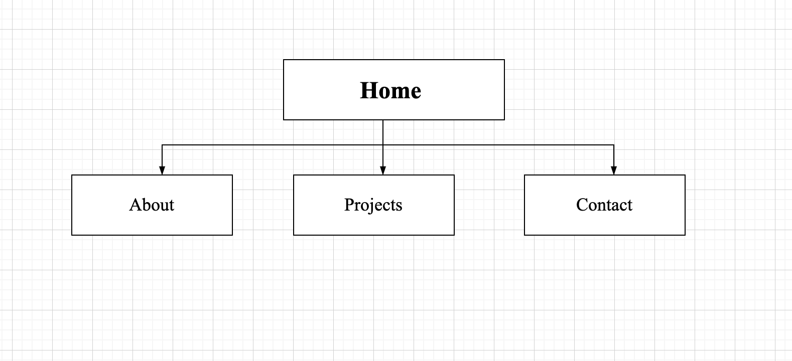

# newportfolio
Github repo:lindaojinnaka/Portfolio

Website: https://lindaojinnaka.github.io/portfolio-site/
  
  
## Purpose
The purpose of my portfolio is to showcase my abilities as a web developer and to also craft my personal brand by expressing my personality throughout each page. 
  
## Functionality and Features
**Component 1:** Hamburger Menu 
 
**Component 2:** Consistent Design
 
**Component 3:** Header 
 
**Component 3:** Footer
 
**Component 4:** External Links 
 
**Component 5:** Consistent Styling 
 
**Component 5:** Accessibility 

## Target Audience
The target audience for my portfolio are: 
1. Interested employers 
2. Recruitment agencies. 

The portfolio is intended to demonstrate my abilities in diferrent tech stachs to potential employers. In addition to this, my portfolio highlights my design style and the colors represent my personality. 
  
  

## Techstack
HTML is used to organize and define how content is displayed

CSS is used to style elements created throughout my webpages.

Github was utilized for version control and website deployment.

Javascript was also used for the drop down link functionality. 

## Site Map 

